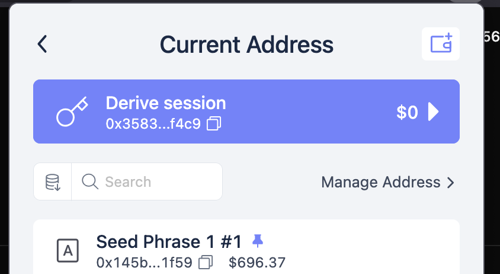
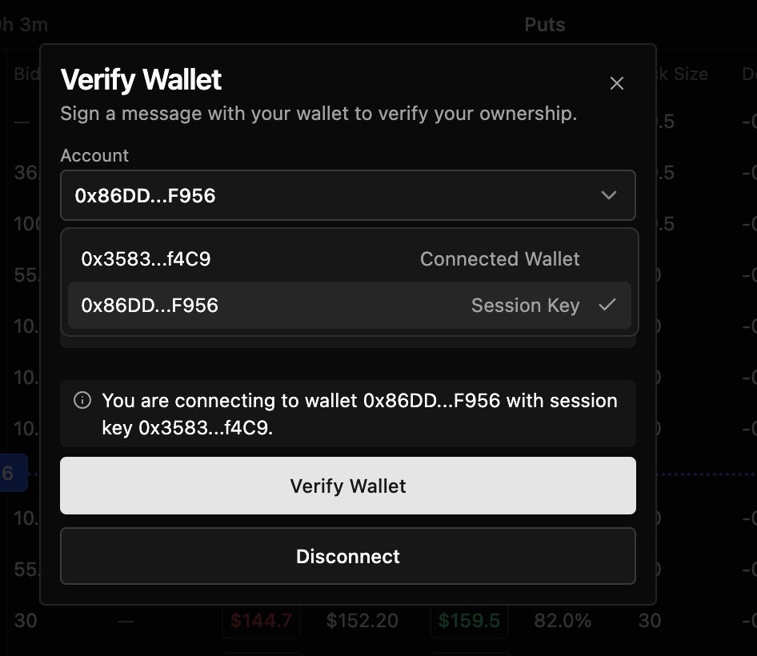
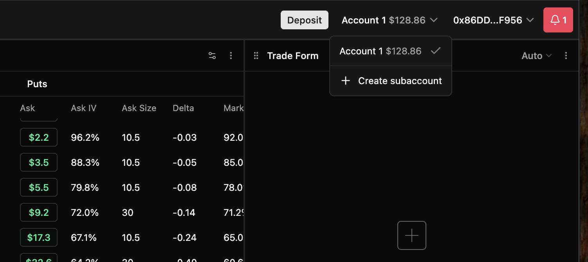

# Derive session key for vault traders

This is a short document describing how a Lagoon vault and a Derive trading key are connected.

## Derive session key

Derive is an options/perp DEX allows users to login directly with their Etheruem wallet and private key.
No email-based account creation is needed.

The session key is a special kind of a private key that allows trading on behalf of the others. 
Someone else, the vault in our case, creates a sesssion key and then approves spendable balance on it in Derive.

The session key is created offchain. Like any Ethereum account, it comes as a private key + address (public key) pair.

## How to use session

First, you need to import the session key to any Ethereum compatible wallet. We recommend Rabby.

You select create account > import private key and then paste in the given key. In Rabby this is the "wallet plus" icon.



After the account is in your wallet go to [app.derive.xyz](https://app.derive.xyz).

Choose connect.

When connecting, you need to pick "Session key" option.

.

Then you need to sign a message to confirm the ownership of the key.
After this you are signed in to Derive "as the vault". You should see the vault trading balannce as "Account 1" subaccount.




*Note*: If the connection fails or you choose a wrong choice, you need to reset Derive cookies and local storage in your web browser.

## Managing trading capital

The trading capital available on the session key is subject to vault deposit/redemptions. 

TODO: More on this later.

## High-level vault architecture description

At the core of the vault is Safe multisignature wallet smart contract which has a USDC allowance on Derive account.
The multisignature wallet has authorised a session key to use this balance on Derive for trading through the approve()
mechanism of ERC-20 tokens.

When new deposits enter to the smart contract, the trader can claim them from the Derive user interface as a tradeable balance.

When someone redeems to the vault, the redemption is processed from the free cash balance. If there is not enough free cash,
then redemptions must wait until the open trading positions are closed.

For the Minimum Viable Prototype, the vault lives on Derive L2 chain, but this may change in the future.

```
                        DERIVE CHAIN (OP Stack L2)
┌─────────────────────────────────────────────────────────────────────┐
│                                                                     │
│   INVESTORS / DEPOSITORS                                            │
│   ┌──────────────┐                                                  │
│   │  Depositor    │── approve USDC ─-─┐                             │
│   │  EOA wallet   │── request deposit┐│                             │
│   └──────────────┘                   ││                             │
│                                      ▼▼                             │
│   LAGOON VAULT (ERC-7540)                                           │
│   ┌─────────────────────────────────────────┐                       │
│   │  Vault Contract                         │                       │
│   │  ┌───────────────┐  ┌────────────────┐  │                       │
│   │  │ USDC deposits │  │ Share tokens   │  │                       │
│   │  │ (denomination │  │ (VEGA etc.)    │  │                       │
│   │  └───────┬───────┘  └────────────────┘  │                       │
│   │          │ settle / finalise            │                       │
│   └──────────┼──────────────────────────────┘                       │
│              │                             ▲                        │
│              │ post NAV + settle           │ account_value_func()   │
│              ▼                             │ (pricing / valuation)  │
│   SAFE MULTISIG (Gnosis Safe)              │                        │
│   ┌─────────────────────────────┐          │                        │
│   │  Vault's Safe address       │          │                        │
│   │  (multisig signers)         │          │                        │
│   │                             │          │                        │
│   │  Controls:                  │          │                        │
│   │  • USDC held by vault       │          │                        │
│   │  • Session key registration │          │                        │
│   │  • Deposit manager approval │          │                        │
│   └──────┬──────────────────────┘          │                        │
│          │                                 │                        │
│          │ "Recover" USDC                  │                        │
│          ▼                                 │                        │
│   DERIVE EXCHANGE                          │                        │
│   ┌────────────────────────────────────────┤                        │
│   │  Derive Wallet (derived from Safe)     │                        │
│   │  ┌──────────────────────────┐          │                        │
│   │  │  Subaccount (ID: 143246) │──────────┘                        │
│   │  │  ┌────────────────────┐  │  fetch subaccount value           │
│   │  │  │ USDC margin        │  │  via Derive API                   │
│   │  │  │ Open perp/options  │  │                                   │
│   │  │  │ positions          │  │                                   │
│   │  │  └────────────────────┘  │                                   │
│   │  └──────────────────────────┘                                   │
│   └─────────────────────────────────────────────────────────────────┘
│                                                                     │
└─────────────────────────────────────────────────────────────────────┘

   HOT WALLETS (off-chain key management)
   ┌─────────────────────────────────────────────────────────────────┐
   │                                                                 │
   │  ┌──────────────────┐    ┌──────────────────┐                   │
   │  │  Asset Manager   │    │  Session Key     │                   │
   │  │  Hot Wallet      │    │  Hot Wallet      │                   │
   │  │                  │    │                  │                   │
   │  │  • Settles deps  │    │  • Registered via│                   │
   │  │  • Posts NAV     │    │    Safe tx batch │                   │
   │  │  • Needs ETH gas │    │  • API auth to   │                   │
   │  │                  │    │    Derive exchang│                   │
   │  │                  │    │  • Has expiry dat│                   │
   │  │                  │    │  • Signs trades  │                   │
   │  └────────┬─────────┘    └────────┬─────────┘                   │
   │           │                       │                             │
   │           ▼                       ▼                             │
   │     Lagoon Vault            Derive Matching                     │
   │     settlement              Contract                            │
   │                             (0xeB8d...DeAD)                     │
   └─────────────────────────────────────────────────────────────────┘

   CAPITAL FLOW SUMMARY
   ────────────────────
   Deposit:   Depositor ──USDC──▶ Vault ──settle──▶ Safe ──recover──▶ Subaccount
   Trading:   Session Key signs orders on Derive orderbook via API
   Valuation: Trade Executor ──API──▶ Derive subaccount value ──▶ NAV update
   Withdraw:  Subaccount ──▶ Safe ──▶ Vault ──▶ Depositor (reverse flow)
   ```